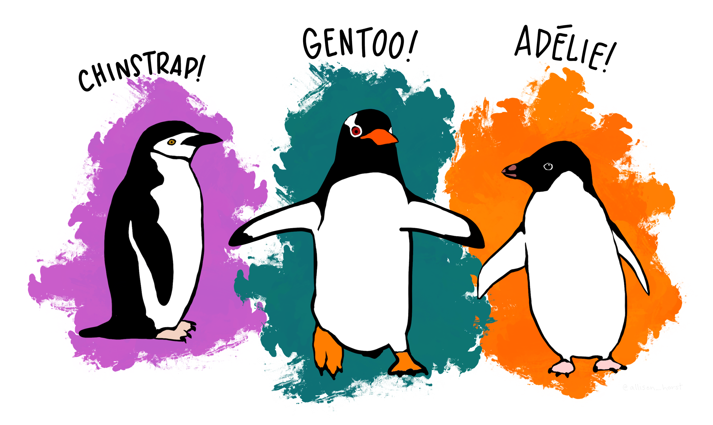

# Penguins Classification and Vizualization Dashboard

Dashboard Featuring Data Vizualization and Classifier Model Predictions. Implemented using Plotly Dash. A Project for Data Visualization Course during ITI AI-Pro.

<div align="center"></div>

## Dataset

- Palmer Archipelago (Antarctica) Penguins, [Kaggle](https://www.kaggle.com/datasets/parulpandey/palmer-archipelago-antarctica-penguin-data)

## Process Workflow

- Data Exploration
- Data Preparation
- Model Selection
- Dashboard Layout Desgin
- Design Interactivity
- Dashboard Implementation
- Heroku Deployment

## Project Structure
```
DashboardProject
├── assets
│   ├── data
│   │   ├── penguins_cleaned.csv
│   │   ├── penguins_size.csv
│   │   ├── train_minmax.csv
│   │   ├── train_none.csv
│   │   ├── train_robust.csv
│   │   ├── train_std.csv
│   │   ├── valid_minmax.csv
│   │   ├── valid_none.csv
│   │   ├── valid_robust.csv
│   │   └── valid_std.csv
│   ├── fonts
│   │   ├── Mina
│   │   │   ├── Mina-Bold.ttf
│   │   │   └── Mina-Regular.ttf
│   │   └── Quattrocento_Sans
│   │       ├── QuattrocentoSans-BoldItalic.ttf
│   │       ├── QuattrocentoSans-Bold.ttf
│   │       ├── QuattrocentoSans-Italic.ttf
│   │       └── QuattrocentoSans-Regular.ttf
│   ├── imgs
│   │   └── penguins.png
│   └── styles.css
├── Data Engineering.ipynb
├── main.py
├── Models.ipynb
├── Plots Exploration.ipynb
└── README.md
```

## Deployed Version
Check the Live Dashboard on <a href='https://penguins-dash.herokuapp.com/' target="_blank">Heroku</a>

## Team Members

- [AbdElrahman Eid](https://github.com/AbdElrahman-A-Eid)
- [Ahmed Atef Azzam](https://github.com/AhmedAzzam99)
